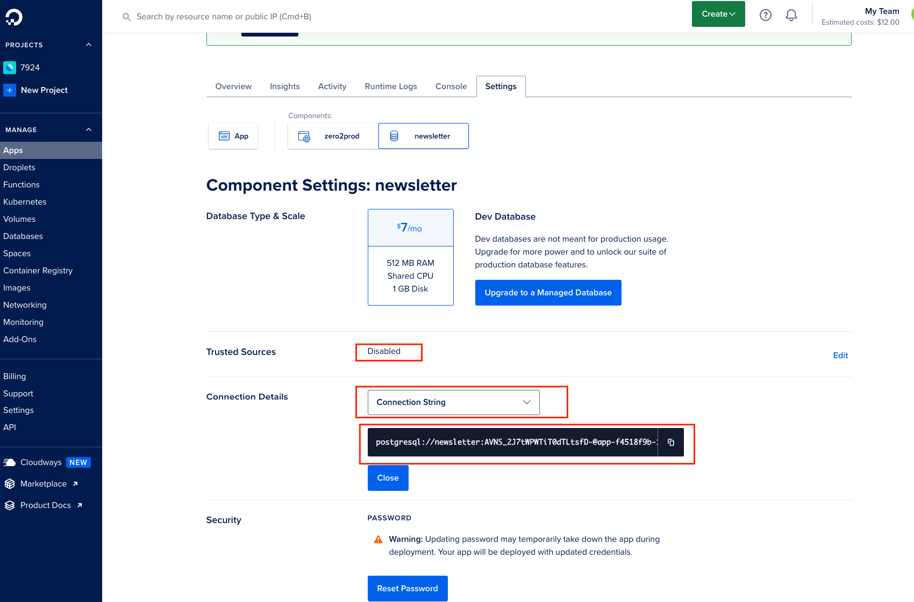

### Set up PG
```bash
 ./scripts/init_db.sh  
 # or
 SKIP_DOCKER=true ./scripts/init_db.sh 
```

### Commands

```bash
cargo test
```

```bash
cargo tarpaulin --ignore-tests
```

```bash
cargo check
```

```bash
cargo clippy
```

```bash
cargo audit
```

```bash
cargo fmt
```

```bash
cargo run
```


### routes
```bash
curl -v http://127.0.0.1:8000/health_check
```


### CI
```bash
docker build --tag zero2prod --file Dockerfile .
```


### digital ocean apps
```bash
brew install doctl
doctl auth init
doctl apps create --spec spec.yaml
doctl apps list
# update if necessary
doctl apps update uuid-of-apps-taken-from-previous-command-output --spec=spec.yaml
```

##### run migration
##### copy database connection string from do admin

```bash
DATABASE_URL=postgresql://newsletter:<PASSWORD>@<HOST>:<PORT>/newsletter?sslmode=require sqlx migrate run 
```

#####
```bash
curl --request POST \
--data 'name=le%20guin&email=ursula_le_guin%40gmail.com' \
https://{subdomain}.ondigitalocean.app/subscriptions \
--verbose

```